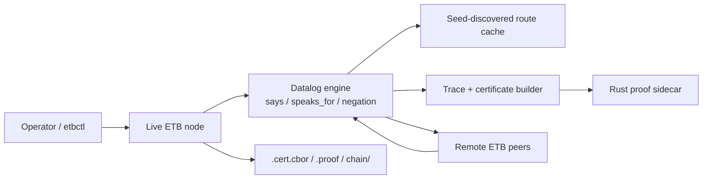

# etb3

Peer-to-peer Evidential Tool Bus prototype in C11 with:

- stratified Datalog
- `says`
- `speaks_for`
- interpreted predicates via subprocess adapters
- deterministic trace and certificate export
- seed-based service discovery and route exchange
- snapshot/signer scaffolding
- Rust proof sidecar

## Architecture Docs

Detailed architecture and communication diagrams live in:

- [docs/README.md](/Users/e35480/projects/misc/ETB/etb3/docs/README.md)
- [docs/architecture.md](/Users/e35480/projects/misc/ETB/etb3/docs/architecture.md)
- [docs/ui-dashboard.md](/Users/e35480/projects/misc/ETB/etb3/docs/ui-dashboard.md)

Top-level system view:



The full docs page adds a fuller component diagram plus sequence diagrams for:

- seed discovery bootstrap
- two-node banking
- four-node visa coalescing
- independent proof verification

Temporal semantics today:

- `A @ t` is enforced against the local node clock
- `A at T` is currently an exact-match temporal tag, not a verified chain anchor
- temporal annotations are committed into certificates/traces/proofs, but their
  truth is not independently attested yet

The fuller explanation is in
[docs/architecture.md](/Users/e35480/projects/misc/ETB/etb3/docs/architecture.md).

## Live UI

The repo now includes a local React dashboard that visualizes live ETB nodes,
query phases, and inter-node communication.

Start it with a single command:

```sh
npm run ui -- --port 4090
```

Then launch live nodes or a demo script. As nodes come up they will appear in
the graph, and incoming communications are rendered as animated dots moving
between nodes.

The dashboard also includes a control deck:

- a query line that can send a live query to a running node such as `client` or
  `customer`
- node launch buttons for the banking and visa example topologies
- a scrollable node catalog loaded from
  [ui/node-presets.json](/Users/e35480/projects/misc/ETB/etb3/ui/node-presets.json),
  so you can extend the list without editing the dashboard server
- a proof-check button that runs the bundled verifier on the most recent
  certificate/proof artifacts returned by the dashboard query
- highlighted logic-hop entries so remote Datalog invocations stand out from
  seed-discovery traffic

The UI persists its own logs and query artifacts under:

- `.etb/ui-dashboard/logs/`
- `.etb/ui-dashboard/queries/`

The UI guide is in
[docs/ui-dashboard.md](/Users/e35480/projects/misc/ETB/etb3/docs/ui-dashboard.md).

## What Is Distributed Today

The repo now has a live distributed mode built around long-running TCP nodes:

- `etbd serve ... --listen HOST:PORT` starts a node that stays alive and answers
  remote proof queries
- `etbctl query HOST:PORT 'goal(...)'` queries a live node over localhost/TCP
- nodes can bootstrap with `--seed HOST:PORT`
- nodes exchange route snapshots during announces, queries, and registry fetches
- when a clause body contains a remote `K says A`, the node can automatically
  resolve a live endpoint for principal `K`, query that peer, verify the
  returned proof bundle, import the certificate answers, and continue deriving
  the local result
- explicit `--peer PRINCIPAL=HOST:PORT` routing is still supported as a manual
  override, but the examples no longer require it

That is what makes the current prototype distributed: proofs and claims can be
resolved by live nodes over the network instead of exchanging certificate files
manually.

What is still not finished:

- signed discovery records
- heartbeat-based liveness and failure detection
- TLS transport
- stronger membership semantics than best-effort route propagation

So the live mode is real distributed query execution with seed-based discovery
and route propagation, but not yet the full signed heartbeat/TLS system from
the long-term plan.

## Build

```sh
cmake -S . -B build
cmake --build build -j4
```

Build the current proof sidecar when you want proof generation and proof
verification:

```sh
cargo build --manifest-path adapters/zk-trace-check/Cargo.toml
```

Install the React dashboard dependencies once:

```sh
npm install
```

## Manual Test Invocation

Run the C test executable directly:

```sh
./build/etb_tests
```

Run the whole CTest suite:

```sh
ctest --test-dir build --output-on-failure
```

Run just the two-node banking integration test:

```sh
ctest --test-dir build -R etb_two_node_banking --output-on-failure
```

Run the live discovery banking and visa integrations:

```sh
ctest --test-dir build -R etb_live_seed_banking --output-on-failure
```

```sh
ctest --test-dir build -R etb_live_seed_visa --output-on-failure
```

Run the banking integration script yourself:

```sh
/bin/zsh tests/integration/two_node_banking.sh "$PWD" "$PWD/build"
```

Add `--verbose` when you want the script to print each command it runs:

```sh
/bin/zsh tests/integration/two_node_banking.sh "$PWD" "$PWD/build" --verbose
```

Run the live discovery integrations yourself:

```sh
/bin/zsh tests/integration/live_seed_banking.sh "$PWD" "$PWD/build"
```

```sh
/bin/zsh tests/integration/live_seed_visa.sh "$PWD" "$PWD/build"
```

The integration and demo shell scripts all support `--verbose` for command
tracing and log-path output.

The integration script assumes:

- you are running from the repository root
- `cmake --build build -j4` has completed
- `cargo build --manifest-path adapters/zk-trace-check/Cargo.toml` has completed

## Writing Your Own Tests

There are two current test styles.

### 1. C unit/integration tests

The existing executable is [`tests/test_main.c`](/Users/e35480/projects/misc/ETB/etb3/tests/test_main.c).
Add a new `static void test_...` function, call it from `main`, then rebuild:

```sh
cmake --build build -j4
./build/etb_tests
```

This is the right place for:

- parser tests
- local engine tests
- delegation/negation tests
- direct capability invocation tests
- snapshot/certificate tests

### 2. Shell integration tests

Put a script under [`tests/integration`](/Users/e35480/projects/misc/ETB/etb3/tests/integration)
and register it with `add_test(...)` in
[`CMakeLists.txt`](/Users/e35480/projects/misc/ETB/etb3/CMakeLists.txt).
The existing banking script is the template:

- [`tests/integration/two_node_banking.sh`](/Users/e35480/projects/misc/ETB/etb3/tests/integration/two_node_banking.sh)

This is the right place for:

- multi-process flows
- certificate import/export tests
- proof generation/verification tests
- end-to-end example scenarios

There is a more detailed test-writing note in
[`tests/README.md`](/Users/e35480/projects/misc/ETB/etb3/tests/README.md).

## Run a Query

```sh
./build/etbd path/to/program.etb 'query(term)'
```

`etbd` also supports:

- `--import-cert FILE` to import answers from another node's certificate
- `--cert-out FILE` to write the CBOR certificate bundle
- `--proof-out FILE` to generate the current end-to-end proof bundle
- `--verify-proof` to verify the generated proof immediately
- `--prover PATH` to select the proof sidecar binary

## Run a Live Node

```sh
./build/etbd serve path/to/program.etb \
  --node-id my-node \
  --listen 127.0.0.1:7601 \
  --seed 127.0.0.1:7602 \
  --prover ./adapters/zk-trace-check/target/debug/zk-trace-check
```

You can still pin a manual route with `--peer PRINCIPAL=HOST:PORT`, but the
seed-based discovery path is the preferred way to launch the live examples.

Query a live node:

```sh
./build/etbctl query 127.0.0.1:7601 'goal(term)' \
  --cert-out /tmp/result.cert.cbor \
  --proof-out /tmp/result.proof \
  --bundle-dir /tmp/result-chain \
  --verify-proof \
  --prover ./adapters/zk-trace-check/target/debug/zk-trace-check
```

## Included Sample Adapters

- `sample_concat`: deterministic capability returning a concatenated string
- `sample_receipt`: evidence-producing capability returning a digest receipt

## Proof Sidecar

The Rust sidecar lives in [`adapters/zk-trace-check`](adapters/zk-trace-check) and
currently provides commands for:

- `segment-prove`
- `fold`
- `prove`
- `verify`

`prove` emits a proof bundle for a certificate, and `verify` checks that proof
bundle against the certificate. The current backend is
`ristretto-pedersen-opening-v1`: it hashes the certificate with SHA-256, binds
that hash into a Pedersen-style commitment on the Ristretto group, and proves
knowledge of the opening with a Schnorr-style non-interactive proof.

That means the backend is now a real cryptographic proof/verifier flow, not the
old deterministic placeholder. It still does not prove full ETB derivation
semantics yet. The statement being proved today is a certificate-bound opening
relation, not the eventual trace-check circuit from the long-term plan.

## Example Suite

The examples directory now includes:

- banking: two-node customer/teller certificate exchange
- visa: two-node applicant/consulate certificate exchange
- live-banking: two live nodes that query each other over ports
- live-visa: four live nodes with client -> authority -> delegates
- delegation: transitive `speaks_for`
- negation: stratified negation-as-failure
- tooling: interpreted predicate pipeline using the sample adapters
- temporal: `@ t` and `at T` matching

See [`examples/README.md`](/Users/e35480/projects/misc/ETB/etb3/examples/README.md)
for exact commands for each example.

## Two-Node Banking Example

This repo includes a customer node and a teller node:

- customer program: [examples/banking/customer.etb](/Users/e35480/projects/misc/ETB/etb3/examples/banking/customer.etb)
- teller program: [examples/banking/teller.etb](/Users/e35480/projects/misc/ETB/etb3/examples/banking/teller.etb)

Build both the C binaries and the proof sidecar:

```sh
cmake -S . -B build
cmake --build build -j4
cargo build --manifest-path adapters/zk-trace-check/Cargo.toml
```

Run the customer node to emit a certificate and full proof bundle for the
withdrawal request:

```sh
./build/etbd \
  examples/banking/customer.etb \
  'customer says withdrawal_request(tx1001,alice,50)' \
  --cert-out /tmp/customer.cert.cbor \
  --proof-out /tmp/customer.proof \
  --prover ./adapters/zk-trace-check/target/debug/zk-trace-check \
  --verify-proof
```

Run the teller node, import the customer's certificate, derive approval, and
emit its own proof bundle:

```sh
./build/etbd \
  examples/banking/teller.etb \
  'approved(tx1001,alice,50)' \
  --import-cert /tmp/customer.cert.cbor \
  --cert-out /tmp/teller.cert.cbor \
  --proof-out /tmp/teller.proof \
  --prover ./adapters/zk-trace-check/target/debug/zk-trace-check \
  --verify-proof
```

You can also verify either proof bundle directly:

```sh
./adapters/zk-trace-check/target/debug/zk-trace-check verify \
  /tmp/customer.cert.cbor \
  /tmp/customer.proof
```

The same file-based flow is exercised automatically by the integration test
`etb_two_node_banking`, while the live discovery flow is exercised by
`etb_live_seed_banking`.

## Current Limits

- The proof sidecar now uses a real cryptographic proof relation, but it still
  is not the final trace-checking ZK proof for ETB derivations.
- The file-based multi-node examples still model distributed exchange by
  importing certificate files between separate `etbd` invocations.
- The live node discovery protocol is seed-based and best-effort. It does not
  yet provide signed heartbeats, revocation, or transport security.
- The peer membership, TLS, and registry layers are still not production
  complete.
