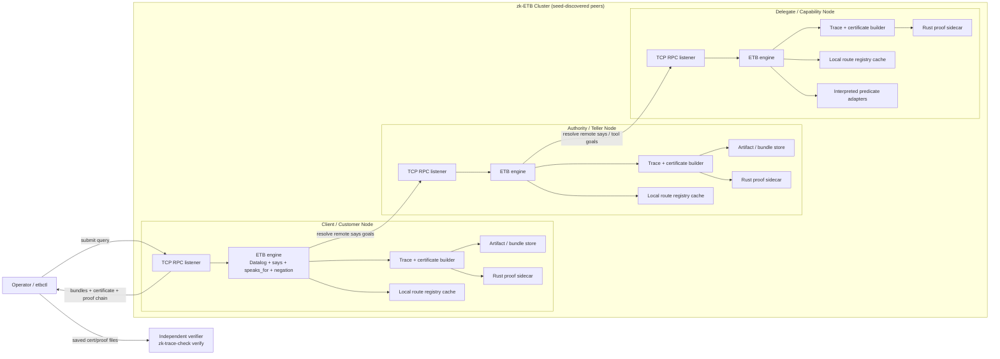
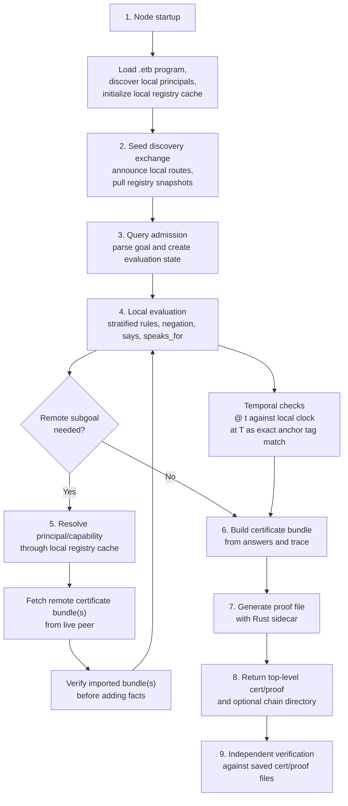
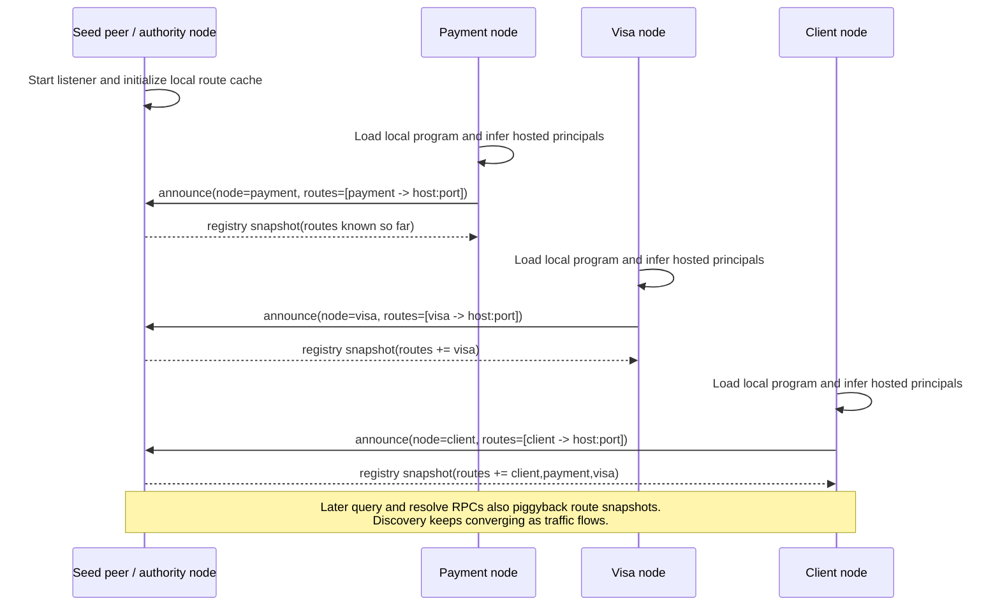
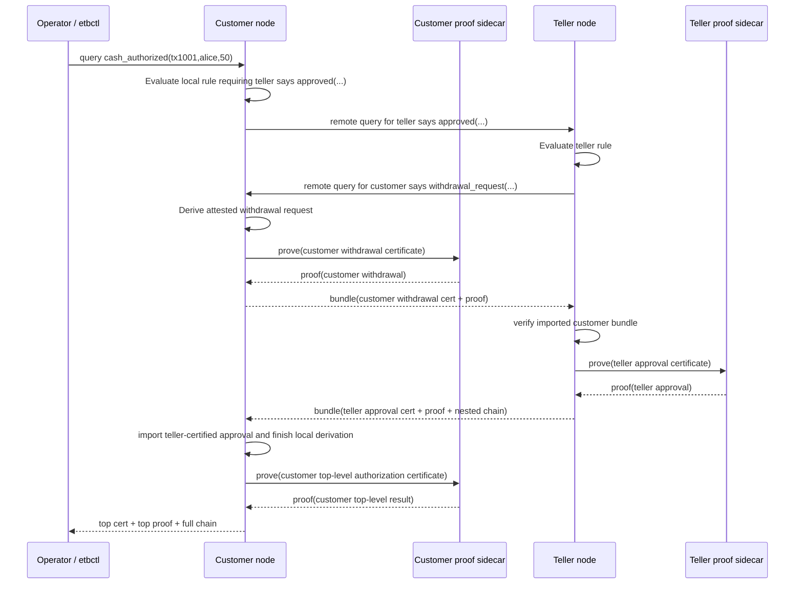
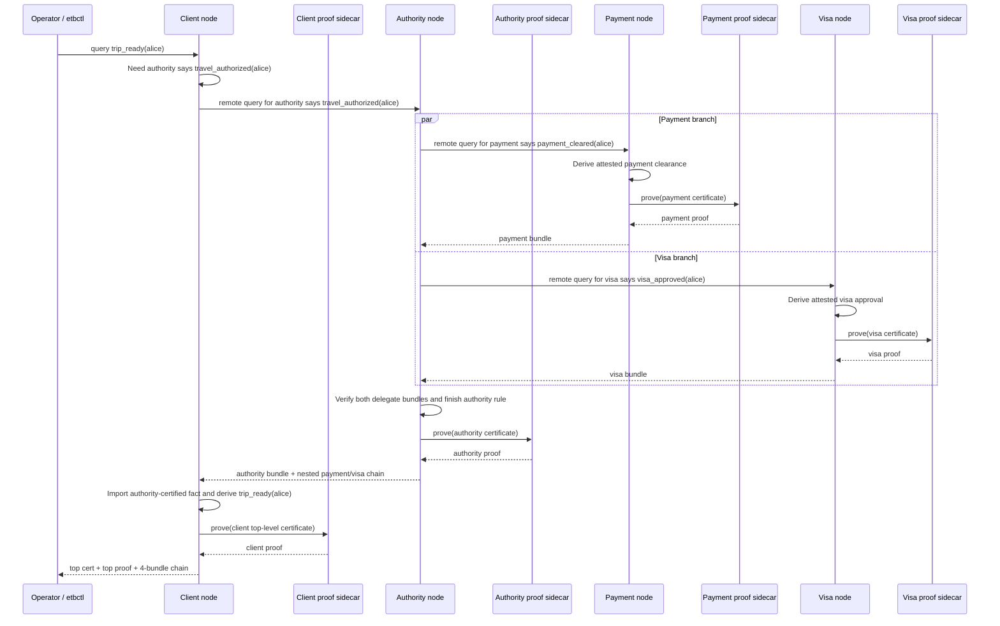
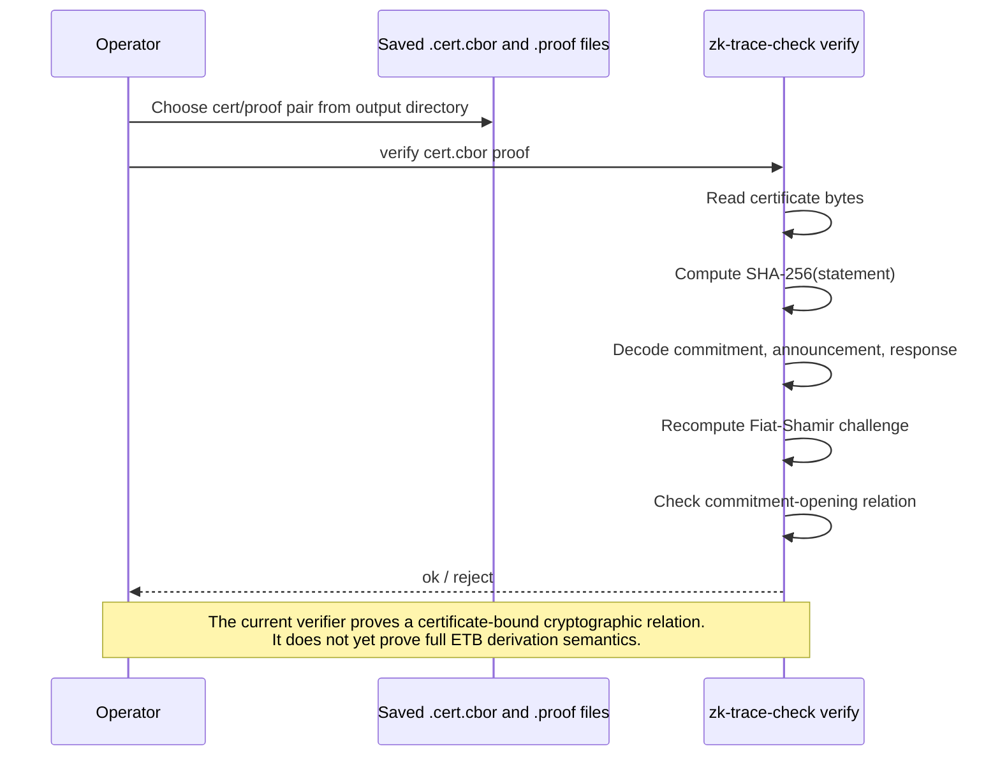

# Architecture And Communication Flows

This page documents the current zk-ETB prototype as it exists in this repo:

- C11 ETB nodes running as long-lived TCP services
- seed-based route discovery and registry exchange
- distributed resolution of `K says A` subgoals
- deterministic certificate export
- a Rust proof sidecar for certificate-bound proof generation and verification

The diagrams below describe the current implementation, not the eventual
heartbeat/TLS/signed-discovery design.

## System Architecture

## Query Lifecycle Phases

## Sequence: Seed Discovery Bootstrap

This is the current best-effort discovery path. A node learns routes from seed
peers and from later query traffic.

## Sequence: Two-Node Banking Query

This is the live customer/teller example.

## Sequence: Four-Node Visa Authorization

This is the coalesced client-authority-payment-visa example.

## Sequence: Independent Proof Verification

This shows the post-processing path after `--out-dir` or `--bundle-dir`
artifacts have been written to disk.

## Reading The Diagrams

## Temporal Operators Today

The current fragment does include temporal syntax and partial temporal
enforcement, but it is important to be precise about what is and is not
attested yet.

- `A @ t` is parsed and stored in the AST, and evaluation checks it against the
  node's local wall clock.
- `A at T` is parsed and stored in the AST, but today it behaves as an exact
  annotation match against facts carrying the same `at T` tag.
- Temporal annotations survive canonicalization, so they are part of the atom
  text committed into trace digests, certificates, and the current proof input.
- The current verifier therefore proves a certificate-bound relation over atoms
  that include temporal annotations, but it does not independently validate the
  truth of wall-clock time or blockchain inclusion.

Concretely, the current implementation is:

- `@ t`: local clock enforcement in
  [eval.c](/Users/e35480/projects/misc/ETB/etb3/src/engine/eval.c)
- `at T`: exact-match temporal tagging in
  [eval.c](/Users/e35480/projects/misc/ETB/etb3/src/engine/eval.c)
- temporal parsing in
  [parser.c](/Users/e35480/projects/misc/ETB/etb3/src/core/parser.c)
- temporal canonicalization in
  [canon.c](/Users/e35480/projects/misc/ETB/etb3/src/core/canon.c)
- trace commitment of canonical atoms in
  [trace.c](/Users/e35480/projects/misc/ETB/etb3/src/engine/trace.c)

What is not implemented yet:

- signed time attestations
- blockchain inclusion proofs for `at T`
- an external consensus oracle for time/anchor truth
- a proof relation that validates temporal truth, rather than only committing to
  temporal annotations already present in the certificate

- Discovery is currently seed-based and best-effort.
- Route knowledge is carried by explicit announce/registry/resolve traffic.
- Imported remote bundles are verified before their answers are fed back into
  the local ETB engine.
- Each node emits its own certificate and proof; the top-level response returns
  a chain of these bundles so they can be checked independently.
- The current proof backend is real cryptography, but the proved statement is
  still narrower than the eventual full trace-check circuit.
